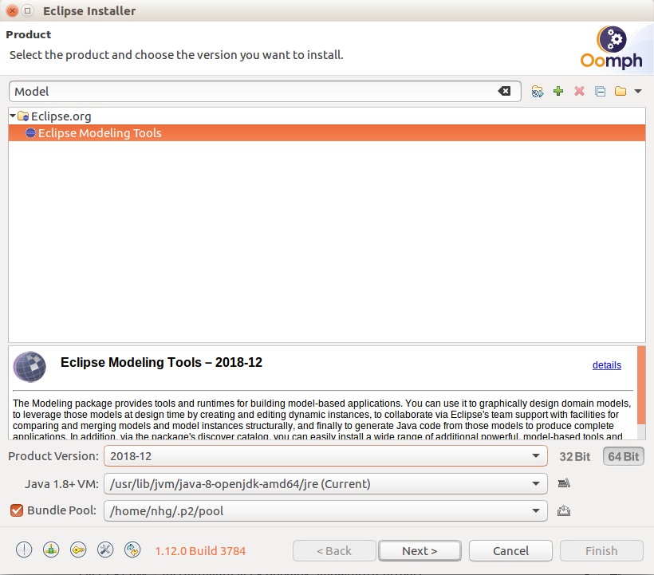

# Installation and setup requirements

Download the official [Eclipse Installer](https://www.eclipse.org/downloads/packages/installer) for your preferred operating system. Execute the installer and choose the advanced mode (menu on the right-up corner). Select the Product *Eclipse Modeling tools* package, for the version it is recommended use *Oxygen*.



Press *Next* and add a new *User project* pressing the green button *+*:
```
Catalog: Github Projects
Resource URIs: https://raw.githubusercontent.com/ipa320/ros-model/master/EclipseInstaller/ROSModel.setup
```


Select the the ROS Model project (under Github Projects -> <User>) and press next. 

By default the ROS tooling installation will be saved under the folder *ros-model-master* in your home directory. In case your github credentials are not setup on your machine, change the *Ros model Github repository* to the *HTTPs(read-write)* option.

Follow the installation instructions of the Oompth installer dialog, after the installation eclipse will be restarted to launch the ROS tooling configuration. Finally, when all the startup tasks finished press "Worbench".

# Setup the work environment and start the software

## Setup the environment and start the eclipse application


1. Start the ROS tooling:
* select de.fraunhofer.ipa.ros.siriusand press the button *Run*


2. Import the common communication objects project (under the "examples" folder of this repository) to the workbench of your application:
```
de.fraunhofer.ipa.ros.communication.objects
```

Now that your workspace is setup and the eclipse application running you can start creating your project and defining your ROS system


